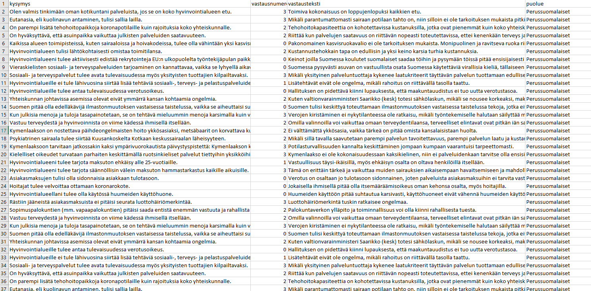

# YleSelenium

Tämä web scrape sovellus hakee YLE:n aluevaliiehdokkaat. Kysymykset jotka heille on annettu ja ehdokkaiden vastaukset. 

Lopputuloksena on massiivinen tietokanta.

Käyttääksesi sovellusta tarvitset:
Gecko firefox driverin. 
Postgresql tietokannan.
Java 8.

